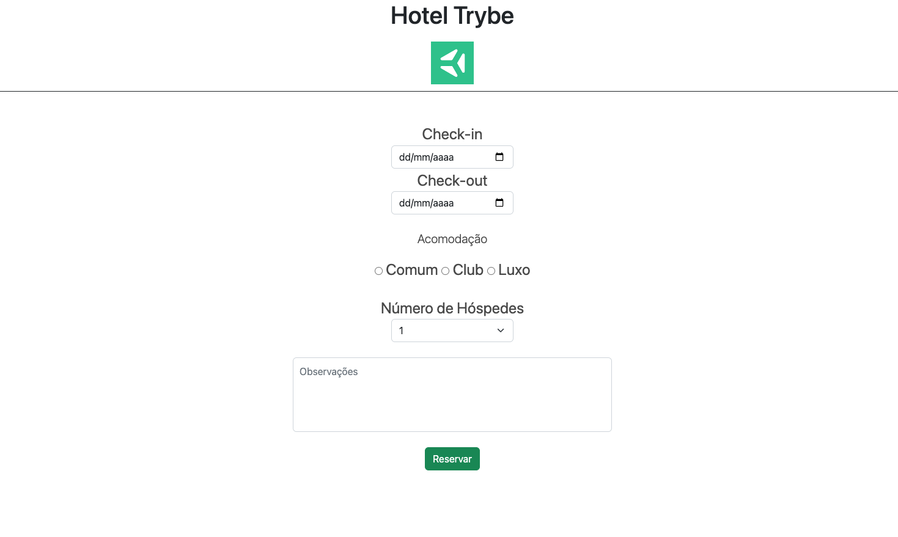

# Dinâmica em duplas - Formulários e Bootstrap

Boas-vindas à nossa primeira dinâmica da Seção 6. Com essa atividade, vocês vão trabalhar em equipes, em busca de uma solução da situação proposta.
A sugestão é que uma pessoa compartilhe a tela, enquanto as duas (ou três) pessoas trocam ideias e desenvolvam juntas.

## Como vai funcionar

Essa dinâmica será divida em duas etapas:

- Dia 6.2 - Criar um formulário e aplicar estilização CSS, com o uso do Bootstrap.
- Dia 6.5 - Trazendo responsividade para a aplicação, com o uso combinado do flexbox.

## Cenário

Uma rede hoteleira entrou em contato, solicitando que vocês desenvolvam o _front-end_ para um formulário de solicitação de reservas. 
O resultado de hoje será parecido com este:

Antes de iniciar os trabalhos, uma das pessoas da dupla deverá clonar esse repositório. 
Não será preciso criar branch e nem abrir Pull Request.  

Caso seja de preferência da dupla, é permitido realizar _fork_ (cópia) do repositório do GitHub e depois realizar o clone. 

## Requisitos

### 1. Faça uma barra superior para o título e a logomarca.

- Utilize `header` para fazer a barra e deve conter a classe `header-trybe`.
- Adicione um titulo: *Trybe Hotel*.
- Adicione uma imagem:
  Para adicionar a imagem você pode utilizar esta url:
  > https://encrypted-tbn0.gstatic.com/images?q=tbn:ANd9GcT3q0v72AJA-p9V_oPst_65uEG9dr1WxKN-ZYp_5gE&s

### 2. Inicie um formulário que deve conter:

- Uma `section` com a classe `hotel-form` para a reserva do hotel
  - Adicione um `input` do tipo `date` para o *Check-in* com a classe `inputCheckin`.
  - Adicione um `input` do tipo `date` para o *Check-out* com a classe `inputCheckout`.
  
- Uma `section` com a classe `hotel-form` selecionarmos os tipos de quartos
  - Adicione um `p` com o texto: *Acomodação*.
  - Adicione um `input` do tipo `radio` para o quarto *Comum* com a classe `bedroom`.
  - Adicione um `input` do tipo `radio` para o quarto *Club* com a classe `bedroom`.
  - Adicione um `input` do tipo `radio` para o quarto *Luxo* com a classe `bedroom`.
  - Todos devem conter o mesmo `name`.
  
- Uma `section` com a classe `hotel-form` para a quantidade de pessoas
  - Adicione um `select` com quatro `options` de 1 ao 4 com a classe `nPessoas`.
  
- Uma `section` com a classe `hotel-form` para observações
  - Adicione uma `textarea` com `placeholder` para indicar que é o campo de observações com a classe `obs`.
  
- Adicione um `button` para enviar o formulário.

### 3. Usando o Bootstrap

- Incorpore o [Bootstrap](https://getbootstrap.com/) no documento HTML, *acima* da tag `link`com o arquivo `style.css`.
- Pesquise por `forms` no Bootstrap e encontre a classe que melhor se adeque, de acordo com a dupla, para estilizar:
  - Campos de datas check-in e check-out;
  - Campo para número de pessoas;
  - Campo para observações.
- Caso esses campos fiquem largos demais, use as classes do Bootstrap empregadas como seletores para diminuir a largura e centralizar os campos.
- Estilize o botão com o uso do Bootstrap.

## Prazo e demais instruções

Teremos 40 minutos direcionados para a dinâmica. 
Caso não seja possível terminar, podem continuar fazendo o trabalho posteriormente. 
É importante lembrar que a mesma branch aberta hoje continuará a ser usada na aula 6.5.
